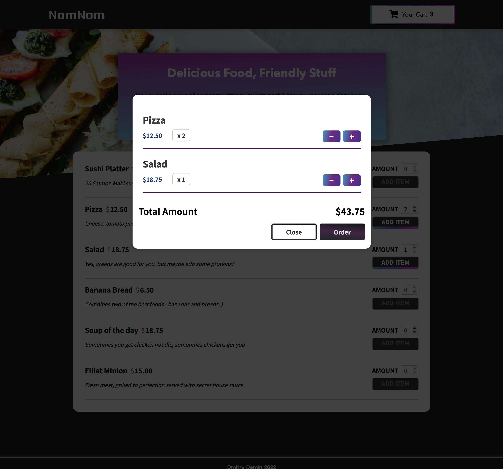
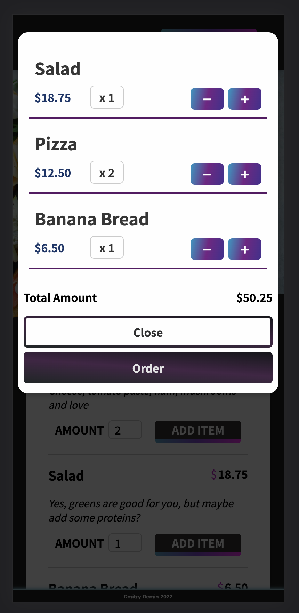

# Cart Demo App 

#### Title: NomNom

This is a small demo app that shows menu and checkout actions that can be applied to a restaurant or any item based shop.

###### Main Screen

###### Items Cart

###### Mobile View

## 

#### How To Start

1. Clone Repo
2. In the project directory, run `npm install`
3. `npm start`

#### Live Demo

**https://demindmi.github.io/nomnom/**

#### Note

This is just a demo of the front-end and react functionalities, there is no submit hook.
